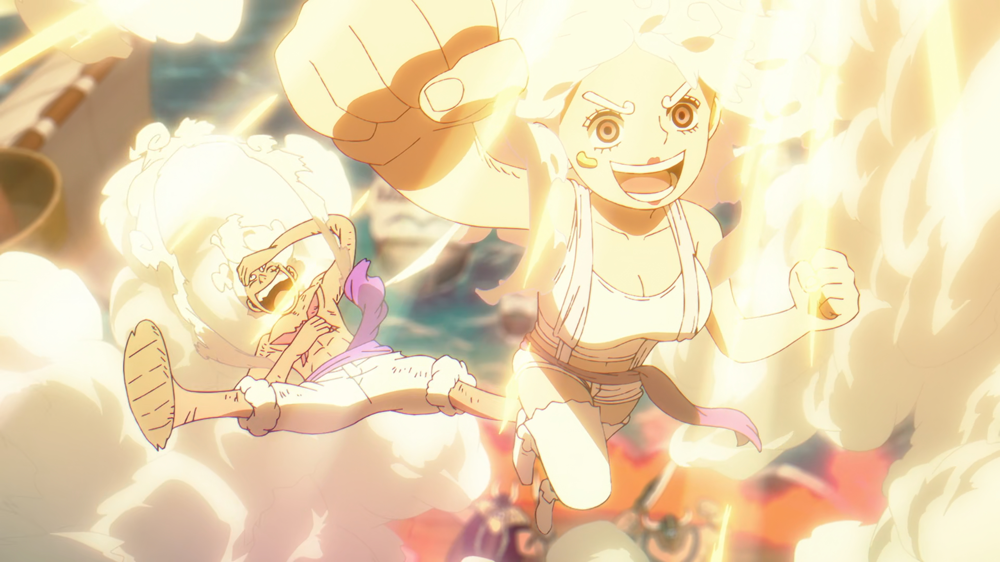

# 🏴‍☠️ Ahoy, Nakama! Welcome to My Grand Line! 🎀

    

## ☠️ Wanted: Dead or Alive - Chinmay Singh ☠️

💰 **Bounty:** ฿12,000,000,000 *(~12 Years of Battle Experience)*  
⚔️ **Epithet:** "The Code Shogun" — Lead Platform Shipwright  
🍎 **Devil Fruit:** `Code-Code no Mi` (Model: Polyglot)     
🗾 **Last Seen:** The Eastern Blue (NCR, India)     
🔗 **Vivre Card:** [LinkedIn](https://linkedin.com/in/chinmay-singh) | [GitHub](https://github.com/singhchinmay?tab=repositories)

A veteran of the New World! 🌊 Sailing the seas of cloud-native waters, forging powerful weapons in **Node.js, TypeScript, Go, Rust & AWS** ⚔️ Battled alongside legendary crews like **Sony** 📺, the **Finance Marines** 💰, **Japanese Enterprise Shoguns** 🗾, and commanded **300+ CDN warships** across the globe! 🌐 Known for lightning-fast conquests ⚡ and leading nakama into battle (3-4 years commanding crews of 2-4)! にゃ〜☆ 🚀

---

## ⚓ My Haki Powers =^._.^= ⚓

| Haki Type | Power |
|-----------|-------|
| **Conqueror's Haki** 👑 | I see the whole battlefield — from first sketch to final victory! |
| **Armament Haki** 🛡️ | Building fortresses that scale like Whitebeard's crew! |
| **Observation Haki** 👁️ | Sensing bottlenecks before they strike, like Katakuri seeing the future! |
| **Advanced Haki** ⚡ | Protecting the treasure with unbreakable seals! |
| **Nakama Spirit** 🏴‍☠️ | Teaching the crew & making everyone stronger together! |

Currently training with **Bun** and **Rust** — unlocking Gear Second speeds! ⚡ Like Luffy mastering new forms, always evolving!

## 🐱 Hello Kitty's Kawaii Corner 🎀

Even the toughest pirates have a soft side! 🌸
*   **Video & Image Editing:** Making things look *kawaii* and professional. 📽️
*   **Self-Improvement:** Always learning, always growing! 🧠
*   **Interests:** Learning & Teaching · Emerging runtimes (Bun, Rust frameworks) · Distributed Systems · Cost Optimization & Observability · FPS Gaming · Travel & Exploration · Fitness · Anime / Otaku Culture ฅ^•ﻌ•^ฅ

> ***"Programming isn't about what you know; it's about what you can figure out... just like finding the One Piece!"*** 🏴‍☠️

---

## 🍎 Devil Fruit Powers (Technical Skills) ⚔️ =^._.^=

### ⚔️ The Three Sword Style (Languages)

### 🚂 Sea Train (Backend, Frameworks & Architecture)

### 🛡️ Ship's Armor (Frontend & UI)

### 🗄️ Treasure Vault (Datastores)

### ☁️ Sky Island (Cloud & DevOps)

### 🔐 Marine HQ Security

### 🌐 Den Den Mushi APIs & Integrations

### 🔄 Eternal Pose Sync & Data Flows

### 🧪 Grand Fleet Testing & Quality

### 🛠️ Shipwright Tools & Platform Ops

### 📊 Grand Line Product Systems

### 👑 Captain's Log (Leadership & Delivery)

### 🎨 Kawaii Creative Dock

---

## 🏴‍☠️ Voyage Log (Adventures) =^._.^= 🏴‍☠️

### 🚢 Current Quest: Miraic.inc
**Aug 2023 – Present** | *Captain of the Ship* 🏴‍☠️ 

Building a legendary platform for Japanese merchants with LINE powers! Leading a crew of 2 brave nakama! 🗾

**Legendary Feats:**
- 🗡️ Forged 12 powerful domains from scratch — like crafting Meito-grade swords!
- 💰 Created a Berry collection system that never misses (Nami would be proud!)
- 👥 Training the crew: battle planning, reviewing techniques, sharing wisdom

🐾

### ⚓ Past Voyages (The Grand Line Journey)

| Era | Island (Company) | Role | Epic Achievement |
|-----|-----------------|------|------------------|
| 2023 | 🏭 Magic Factory (StreamFT) | Speed Demon ⚡ | Built a treasure sync system in 3 months! SUUUUPER! 🤖 |
| 2022-2023 | 📺 SONY via JoulestoWatts | Guardian 🛡️ | Protected the kingdom with impenetrable barriers! |
| 2022 | 💰 GajiGesa | Warrior 💪 | Defended the financial wellness realm! |
| 2021 | 🛒 eBay via AWF | Contract Master 📜 | Sealed sacred pacts across the seas! |
| 2019-2021 | ⚡ Lenergy Mobility | Payment Shogun 💳 | United 5 treasure gates → +20% gold flow! |
| 2018-2019 | 🌐 Tata Communications | Fleet Admiral 🌊 | Commanded 300+ ships across the world! |
| 2016-2018 | 📚 Scholarnex & Infinite Knowledge | Apprentice 🌅 | Sharpened my first blades and trained for the Grand Line ahead! |
| 2008-2021 | ⛓️‍💥 Freelance, Blogging & PHP Projects | Rogue Adventurer 🏴‍☠ | Charted my earliest maps through blogging, freelance quests, and PHP-forged treasures! |
🐾

---

## ⚓ Special Techniques (Side Quests) =^._.^= ⚓

🎮 **UAC Command Hub** — A cyberpunk control room to watch over all my minions in real-time! Like Doflamingo's strings, but for services!

🏫 **School Management System** — Built with the power of Rust (strong as Garp's fists!) A hierarchy system for schools: from Hokage-level Admins to Genin Students!

🖥️ **Enterprise Fortress** — Constructed a legendary server stronghold! 128GB of raw power, 6TB of treasure storage, shields against all attacks!

😺 **Kaomoji Generator** — Because every message needs more ฅ^•ﻌ•^ฅ and =^._.^= and (╯°□°)╯︵ ┻━┻

---

## 🎓 Training Arc =^._.^= 🎓

### 🏫 Sharda University (The Academy)
**2014 – 2018** | B.Tech. Computer Science

🎯 **Final Boss Project:** Upgraded Wifite into a parallel Wi-Fi security auditing beast that coordinated up to 3 network cards with split battle roles, then unleashed it as my final-year project at the academy! 🥷    
🐾

---

  
   
  <i>"Kaizoku Ou ni ore wa naru!"</i>
    

🚨 SPOILER ALERT — If you have watched till Episode 1150 of One Piece (Egghead Arc), click to reveal! 🚨

<h2><b>Kuma is the Real Hero</b></h2> 
  
<h2><b>And Bonney is the Cutest</b></h2>
  
  

